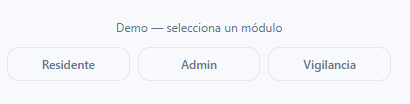

# Prototipo interactivo

El diseño preliminar del Sistema de Reservas Peñas Blancas se encuentra disponible en:

<a href="https://hatch-amused-41669891.figma.site/" target="_blank"> 
🌐 Abrir Sistema de Reservas Peñas Blancas
</a>

Este prototipo representa la experiencia visual esperada para residentes, administración y vigilancia.

### 🔎 Explora el sistema por roles

Selecciona uno de los módulos disponibles para visualizar la experiencia del sistema desde la perspectiva de cada usuario:

- 🏠 **Residente:** realiza y consulta reservas.
- ⚙️ **Administración:** gestiona solicitudes y zonas comunes.
- 🛡️ **Vigilancia:** controla las reservas activas y el acceso.

Cada módulo muestra la interfaz correspondiente al rol seleccionado.